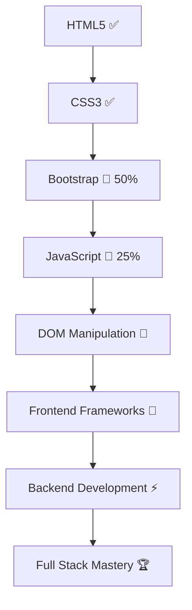

# Travel-Agency 
# Link to the (Live Demo)
https://travel-agency-git-main-mahmoudfawzy10s-projects.vercel.app/

# 👋 Hey there, I'm **Mahmoud Fawzy**

## 🚀 *Aspiring Full-Stack Developer* | 🎯 *Continuous Learner*

---

  

---

### 📌 **Project Description:**

This project, **Agency**, was built using **Bootstrap** to create a responsive and visually appealing website. The Bootstrap grid system, utility classes, and components were used to ensure a clean, structured layout with minimal custom CSS. The framework's responsiveness made it easy to optimize for different screen sizes, improving user experience and accessibility.

A huge thank you to **Osama Elzero** for his incredible teaching and guidance. His tutorials have been a game-changer in my development journey! 🙌

---

### 🛠️ **Tech Stack:**

  
  
  
  
  

---

### 📈 **Development Journey:**

```mermaid
graph TD;
  A[HTML5 ✅] --> B[CSS3 ✅];
  B --> C[Bootstrap 🌟 50%];
  C --> D[JavaScript 🚀 25%];
  D --> E[DOM Manipulation 🎯];
  E --> F[Frontend Frameworks 🌟];
  F --> G[Backend Development ⚡];
  G --> H[Full Stack Mastery 🏆];
```

---

### 🎯 **Current Goals:**

- 📚 Master JavaScript fundamentals and DOM manipulation.
- 🔍 Explore front-end frameworks like React.
- 🗂️ Learn database management (MySQL, Oracle, SQLite).
- 🚀 Build real-world projects to enhance problem-solving skills.
- 🌟 Complete Bootstrap and move to advanced CSS frameworks like Tailwind.

---

### 🌟 **Connect With Me:**

 
   
   

---

### 💡 *"Code, Learn, Repeat! The journey never ends."* 🚀

---

### 🚧 **Latest Updates:**

- 🎯 **JavaScript Fundamentals:** Started learning JavaScript, currently at 25%, focusing on basics like variables, functions, and loops.
- 🌟 **Bootstrap Progress:** Reached 50% proficiency in Bootstrap, focusing on responsive design and utility classes.
- 🚀 **Next Steps:** Dive deeper into JavaScript, explore DOM manipulation, and start building small interactive projects.

---

### Keep coding and learning! 🚀
